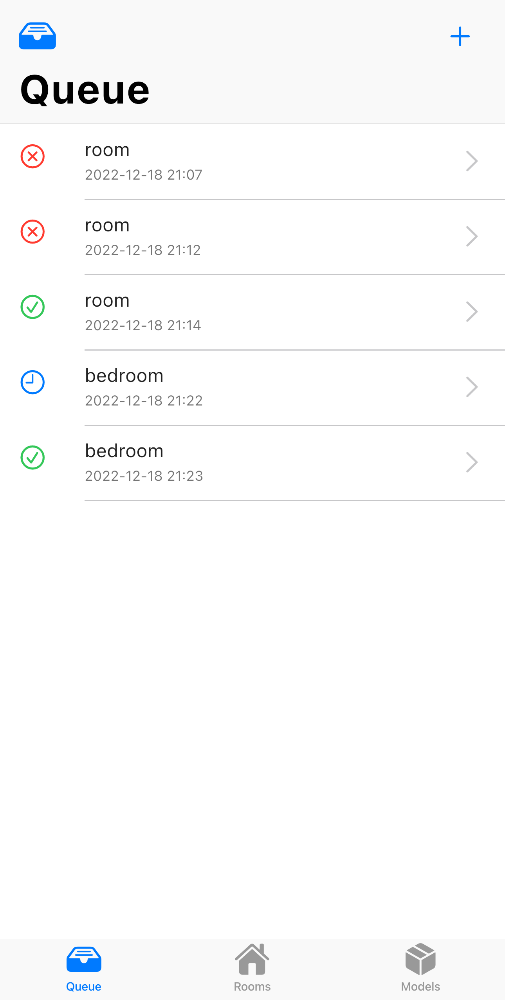
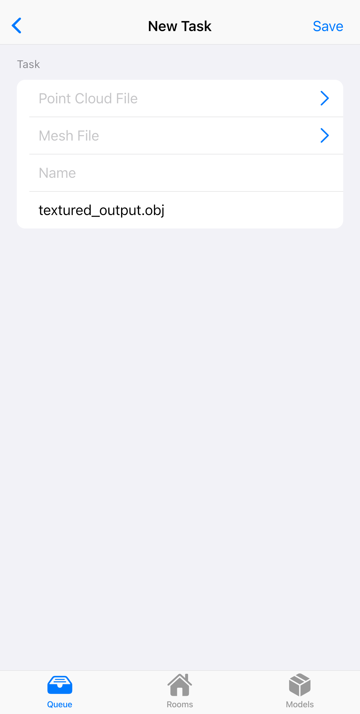
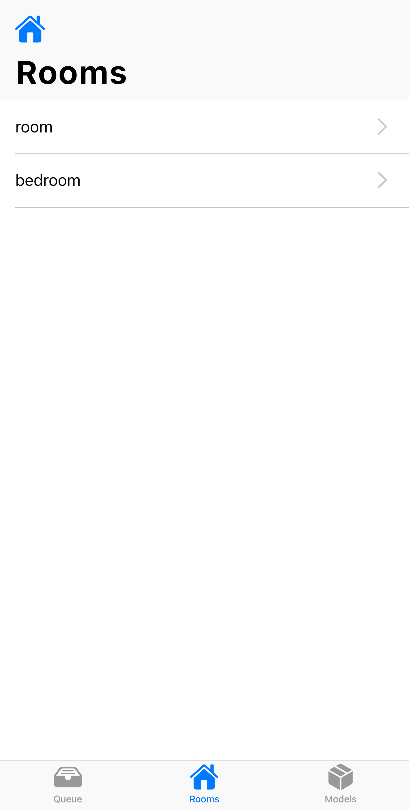
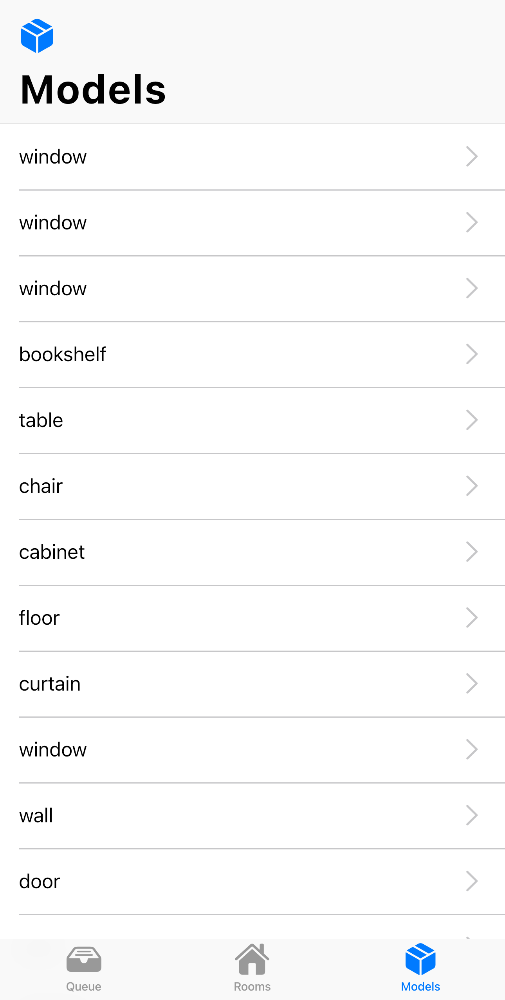

# Mobile App of 3D Room Arrangements System

Welcome to the repository of the mobile app of the project ["3D Room Arrangements using Virtual Reality"](https://github.com/MixedRealityETHZ/3d-vr-room-arrangements). It allows users to submit the 3D scan to the backend for segmentation, and track the status of the task in the Queue tab. The app also provides a handy way to preview existing rooms and models. The application is built with Flutter to support cross-platform on iOS/iPadOS, Android, macOS, Windows, Linux, and Web. The Cupertino widgets are used to provide a native experience on iOS devices.

&nbsp;&nbsp;&nbsp;

---

## Build and Run

To build the app, [Flutter](https://flutter.dev/docs/get-started/install) with the necessary toolchains to build apps for the target platform must be installed. For example, to build the app for iOS, Xcode must be installed as described [here](https://docs.flutter.dev/get-started/install).

Flutter documentation also provides detailed instructions on how to build and run the app on different platforms. For example, on iOS platform, build, sign, and run the app using Xcode as described [here](https://flutter.dev/docs/deployment/ios). CocoaPods also needs to be installed to enable the native iOS file picker.